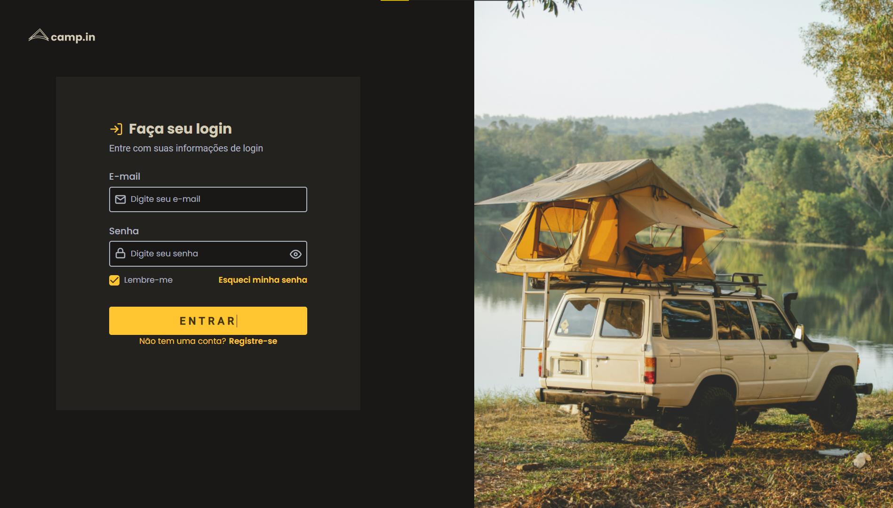
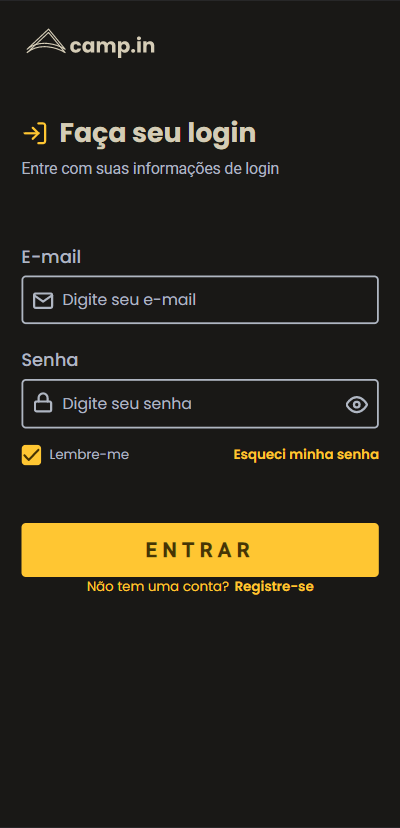

# Login Page CSS
## Preview 💻

  
  

## Sobre o projeto 

Esse projeto foi criado a partir de um dos desafios do Discover, da plataforma de ensino [Rocketseat](https://app.rocketseat.com.br/discover).

Um projeto que tem como objetivo criar uma página para a captação de leads ou newsletter, com a interface de uma tela de login responsiva.

Para mais informações sobre o desafio você pode conferir [AQUI](https://efficient-sloth-d85.notion.site/Desafio-Login-Form-CSS-a10caea5a183494e97eb9ce4f33536b3).

---

## Tecnologias 

As tecnologias usadas foram:

   HTML5
   CSS
 

